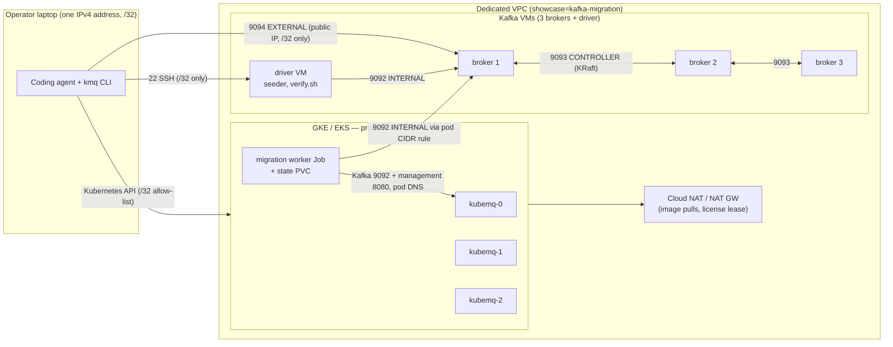

# 01 — Architecture

One dedicated network per run. Kafka on VMs, KubeMQ on managed Kubernetes in the same
network, the migration worker inside Kubernetes, and exactly one address on the internet that
can reach any of it: yours.

## Components

### Dedicated VPC

Terraform creates a custom-mode VPC (GCP) or a VPC with two availability zones (AWS; the EKS
control plane requires two). Nothing depends on a pre-existing `default` network. The subnet
has explicit secondary ranges for pods and services on GCP so the pod CIDR is known at plan
time and can be referenced by firewall rules. Private Kubernetes nodes reach the internet
through Cloud NAT or an AWS NAT gateway for image pulls and the KubeMQ license lease. Every
resource carries the label or tag `showcase=kafka-migration`.

### Kafka: 3 brokers + 1 driver

Apache Kafka 4.x in KRaft mode, each broker both broker and controller, a static 3-voter
quorum. Brokers use a local NVMe disk (GCP local SSD, AWS instance store) as `log.dirs`;
replication factor 3, minimum in-sync replicas 2. Plaintext, unauthenticated — acceptable only
because nothing is reachable from the internet except from your own address.

Static internal and external addresses are allocated **before** the VMs so that the voter
list and advertised listeners are known at plan time. A cloud-init unit runs on every boot:
install Java and the Kafka tarball (verified against the SHA-512 in `versions.env`), mount the
NVMe disk, render `server.properties`, format the storage only if no `meta.properties` exists,
refuse a different cluster id, start Kafka.

A Kafka client bootstraps to one address and then follows the **advertised** address of each
partition leader, so one listener cannot serve both the VPC and your laptop. Each broker has
three:

| Listener | Port | Advertises | Used by |
|---|---|---|---|
| `INTERNAL` | 9092 | the VM's private IP | broker ↔ broker, the driver VM, the migration worker pods |
| `CONTROLLER` | 9093 | — | KRaft quorum between brokers |
| `EXTERNAL` | 9094 | the VM's public IP | `kmq migrate assess` and `kcat` on your laptop |

The driver VM has no Kafka process. It runs the seeder (over 9092 inside the VPC; the produce
itself took about 1 second for 500,000 records on the reference run, the rest of the seed step
is compile and copy) and `verify.sh`, and it is the SSH jump host for broker inspection.

### Firewall / security groups

| Source | Allowed to Kafka VMs |
|---|---|
| VPC subnet | 9092, 9093, 9094 |
| Kubernetes pod CIDR (GCP) / node security group (AWS) | 9092, 9094 only |
| `operator_cidr` (your /32) | 22, 9094 |

The pod-CIDR rule exists because GKE pods talk to VMs in the same VPC with their **pod**
address, not the node's address — the traffic is not translated. Without the rule the worker
cannot reach port 9092. Rules are replaced on change, never appended.

### Kubernetes: GKE or EKS

Three nodes (`n2-standard-4` / `m6i.xlarge`), private, in one zone with the Kafka VMs so no
cross-zone traffic is billed. The API endpoint allow-lists `operator_cidr` only. A default
StorageClass (`standard-rwo` on GKE, `gp3` with the EBS CSI driver on EKS) backs the KubeMQ
volumes and the worker's state volume. On EKS, access is granted through an access entry for
your caller identity (API authentication mode), so there is no `aws-auth` ConfigMap to edit.

### KubeMQ: 3 servers

Installed by `kmq deploy prepare` → `kmq deploy apply` from the input file in
`kubemq/deploy-input.<cloud>.json`: 3 replicas, 50 GiB volume each, the Kafka-compatible
listener on, the next storage engine with strict acknowledgement policy, management API over
TLS with authentication. The `k8s-addons` Terraform root creates the namespace, the license
Secret and a management TLS Secret whose certificate names cover the shared Service and each
pod (`<name>-N.<name>.<namespace>.svc.cluster.local`), because the migration tooling dials
pods directly.

### Migration worker: Jobs on a persistent volume

`kmq migrate job bootstrap` creates a ServiceAccount, a ConfigMap with the immutable profiles,
a Secret with the source credentials and a read-only management key, and a single-writer
persistent volume claim for the checkpoint. Each operation (`plan`, `replicate`, `verify`,
`report`) is one Kubernetes Job that mounts that claim. The worker reaches Kafka through the
`INTERNAL` listener (9092, private IPs) and KubeMQ through pod DNS (Kafka listener 9092 and
management 8080). Nothing in this path leaves the VPC.

### Operator access

You reach three things, all restricted to your `/32`: the Kubernetes API (to run `kmq` and
`kubectl`), the driver VM over SSH, and the brokers' external listener on 9094. The agent
runs on your laptop; its only state is `.rig/env`, written from Terraform outputs.

## What is NOT exposed

- No KubeMQ port is reachable from outside the cluster. No LoadBalancer Services exist.
- No Kafka port is open to `0.0.0.0/0`. Terraform refuses that value for `operator_cidr`.
- Kubernetes nodes have no public IPs.
- The migration worker has no inbound exposure at all.
- No credentials leave the cluster: the plan file holds credential *references*, the Secret
  holds the values.
